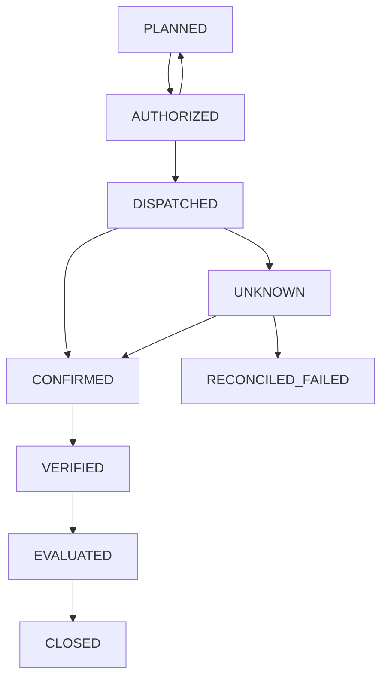

# Accountable Agent: executable acceptance reference

This package turns the agreed invariants into a runnable reference gateway, durable action state machine, fault-injection acceptance tests, generated property checks, and an opt-in real-adapter contract test. It does not send outreach in its default configuration.

**Status:** local reference only. The real integration test is skipped unless a dedicated sandbox adapter is supplied. Passing local tests does not establish production network isolation, identity enforcement, downstream idempotency, factual accuracy, statistical causality, or business value.

## Run

Python 3.10+; standard library only. From this directory:

```sh
python3 -m unittest discover -s tests -v
python3 demo.py
```

The demo simulates a lost response after an external effect, reconciles once, and closes with confirmed simulated execution and unresolved impact. It performs no real external action.

## Files

| File | Purpose |
|---|---|
| `acceptance_spec.json` | Machine-readable action transitions, preconditions, evidence classes, forbidden transitions, recovery rules |
| `engine.py` | Trusted reference gateway using SQLite transactions, durable intent, current authority, independent policy hook, approval binding and single-use nonce |
| `tests/test_acceptance.py` | Fault injection and seeded property checks |
| `tests/test_real_integration.py` | Opt-in external adapter contract; never substitutes a fake for an unavailable real system |
| `demo.py` | Safe local demonstration |
| `VALIDATION.txt` | Captured verification results |

## Architecture boundary and trust assumptions

The Engine is trusted gateway software. It is not an agent sandbox. All administrative, approval, contract creation, evidence, and evaluation APIs must be exposed only through authenticated trusted services in a deployment. Agents must not receive the Engine object, database connection, adapter, credential provider, or writable source code.

The independent `policy_service(actor, action, contract)` hook must obtain policy facts from authoritative sources. The reference fixture uses fixed facts exclusively for testing. Agent-submitted `*_ok` flags are descriptive and cannot override the hook. All actions in this reference require approval; risk-based approval-free operation is intentionally not implemented. Irreversible actions can execute only with the explicit approval and passing independent policy checks.

Network and identity enforcement remain infrastructure requirements: deny direct agent egress, allow only authenticated gateway operations, forbid metadata-service credential discovery, isolate gateway secrets, block alternate subprocess/proxy paths, and test these boundaries from the deployed agent runtime. No such infrastructure is provisioned here.

Some downstream APIs cannot issue credentials for one exact action. For those systems, a trusted gateway must keep credentials isolated and enforce exact-action constraints itself. This package does not implement a credential broker or claim downstream token granularity that has not been demonstrated.

## Lifecycle corrections

Outcome contracts are immutable persisted records validated before action planning. Contract fields include baseline, success criteria, deadline, budget, constraints, human owner, and measurement plan. This validates field presence and basic deadline/budget checks; semantic sufficiency and owner authentication require the trusted contract service.

Mission lifecycle and individual action lifecycle are separate. A mission can contain many actions. This package implements the **action** lifecycle beginning at PLANNED under an existing contract. It does not implement mission aggregation, DRAFT authoring, controlled-learning deployment, or an enterprise memory service.



Additional terminal paths: PLANNED or AUTHORIZED may become CANCELLED; DISPATCHED may become FAILED on explicit external nonexecution evidence. See JSON for the full transition table. The runtime reads that table when enforcing state updates.

RECONCILED is an evidence-bearing event rather than an ambiguous state. It resolves UNKNOWN to CONFIRMED or RECONCILED_FAILED. Unavailable or inconclusive reconciliation leaves the action UNKNOWN, retains its budget reservation, and records human-review need. A failed query does not prove nonexecution.

DISPATCHED means durable dispatch intent exists. Because the process may die between intent commit and network submission, the dispatch log alone cannot prove the request left the gateway. Startup recovery converts surviving DISPATCHED actions to UNKNOWN.

Cancellation after dispatch records a request, not a completed rollback. Existing external effects must be reconciled. Compensation is a separate consequential action requiring its own contract scope, authority, approval, and evidence; compensation adapters are not included.

## Enforcement implemented locally

* Effective child authority is the intersection of its granted permissions, task scope, and recursively current ancestor authority. Revoking a parent blocks subsequent child dispatch.
* Approval binds the actor, contract identity, and full canonical action payload. Mutation revokes all existing approvals and returns the action to PLANNED.
* Dispatch rechecks policy, authority, contract deadline, budget, approval expiry, action hash, revocation, and nonce consumption inside a SQLite transaction.
* Dispatch intent and nonce consumption commit before the adapter call. Adapter errors produce UNKNOWN. Restart recovery and reconciliation do not resubmit the action.
* UNKNOWN cannot verify, redispatch, or claim success. The adapter must provide a record identifier for affirmative execution or nonexecution evidence.
* Execution evidence and impact reports are separate ledger entries. A supported-impact report requires the original measurement-plan hash and references to comparison and analysis records.
* The budget reserves declared action cost for dispatched or uncertain work. Actual-cost reconciliation, refunds, and cost overruns are not implemented.

The gateway assumes serial ownership of each action. SQLite serializes dispatch-intent updates, but cross-service revocation fencing and concurrent recovery/adapter completion are not proven. Use an exclusive recovery owner and implement a defined revocation linearization point in production. Permission changes cannot retroactively prevent an already accepted external action.

## Evidence boundaries

Provenance, integrity, accuracy, and causality are distinct. A hash validates integrity of a bound payload; it does not establish factual correctness. A trusted adapter receipt is an attestation; it is not automatically an accurate description of reality. Neither record identifiers nor the presence of a comparison report establish causal validity.

The adapter is a trusted evidence boundary here. Real adapters must validate issuer identity, signatures where applicable, tenant, resource, action identity, freshness, and actual response semantics. Delivery, delivered-content integrity, factual accuracy, and causal analysis need domain-specific validators. The JSON catalog explicitly marks those requirements; the runtime implements execution evidence and measurement-plan-linked reporting only.

The SQLite ledger is locally persistent, not tamper-proof. Immutable external audit storage, privacy filtering, retention, encryption, signed approvals, authenticated approver identity, and evidence issuer verification remain deployment requirements. Contract records are hashed but not cryptographically signed in this reference.

## Tests and what they establish

The suite covers the five agreed injections: unauthorized instructions, recipient mutation, crash/lost response after effect, parent revocation, and execution success with unsuccessful impact. Additional checks cover expiry, replay, forbidden transition attempts, unavailable policy, independent vetoes, unresolved reconciliation, cancellation semantics, budget reservation, missing evidence, and measurement-plan changes.

Generated property checks exercise 1,000 permission-set intersections, 100 action mutations, and 1,000 seeded lifecycle operations. They are finite randomized property checks, not exhaustive model checking and not shrinking-based Hypothesis tests. The injection test checks that an instruction cannot confer authority; it does not evaluate an LLM's susceptibility to prompt injection.

## Connect a real sandbox adapter

No enterprise endpoint, credential, schema, tenant, or authorized sandbox recipient was supplied. Accordingly no real system is connected or contacted. The integration test is explicitly skipped rather than claimed as a pass.

Provide an operator-authored importable module with `make_fixture()` returning:

```python
{
    "adapter": trusted_adapter,
    "db_path": temporary_database_path,
    "clock": time.time,
    "policy_service": independent_policy_service,
    "action": approved_sandbox_action,
    "contract": sandbox_outcome_contract,
    "cleanup": cleanup_function,
}
```

Adapter methods:

* `execute(idempotency_key, action)`: returns `{status: executed|not_executed|unknown, record_id: ...}`. Evidence must come from the real downstream system. Requests must use provider-supported idempotency or a verified equivalent.
* `reconcile(idempotency_key)`: queries the real external record without submitting the effect again. Missing search results are UNKNOWN unless the provider supplies conclusive nonexecution evidence.
* `assert_effect_count(idempotency_key, expected)`: independently queries external records and fails if the effect count differs.

Run only in a dedicated authorized sandbox:

```sh
AGENT_INTEGRATION_MODE=sandbox AGENT_SANDBOX_ADAPTER=your_sandbox_adapter python3 -m unittest discover -s tests -v
```

This opt-in test verifies real execution, reconciliation if needed, and replay rejection. It does not wire all fault injections to real integrations. Before production acceptance, implement provider-specific fault controls for dropped responses, gateway process termination, approval mutation, revocation races, network bypass, poisoned memory, delegated authority escalation, and unavailable audit/token services. Run each against isolated test resources and independently reconcile external effects.

## Remaining release gates

Real adapters and credential brokerage; deployed sole-egress tests; authenticated owners and approvers; nonbypassable current-policy checks; cross-service revocation fencing; externally immutable audit logs; real duplicate-effect tests; downstream compensation; permission-aware memory; controlled-learning release evaluation; validated causal measurement; and observed business scorecard results.

A passing reference model demonstrates local enforcement behavior under the tested conditions. Enterprise accountability remains an unproven deployment claim until those gates pass.
